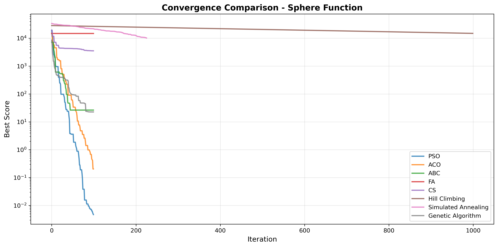
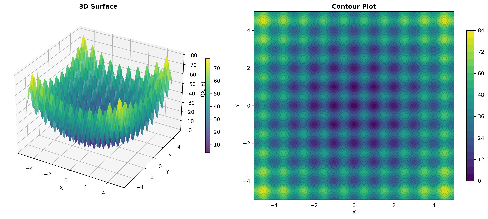
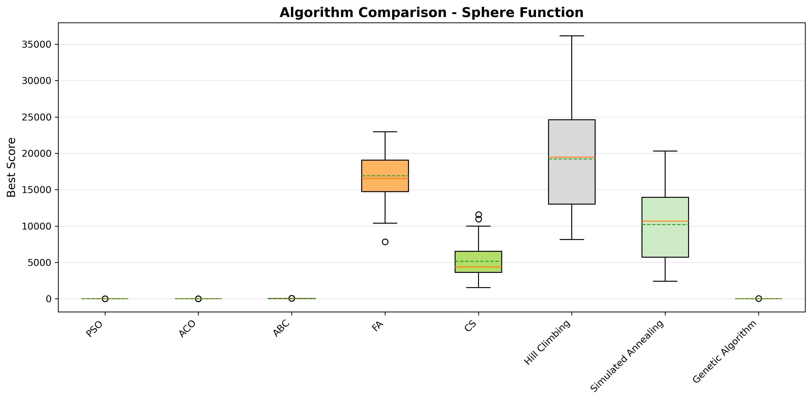
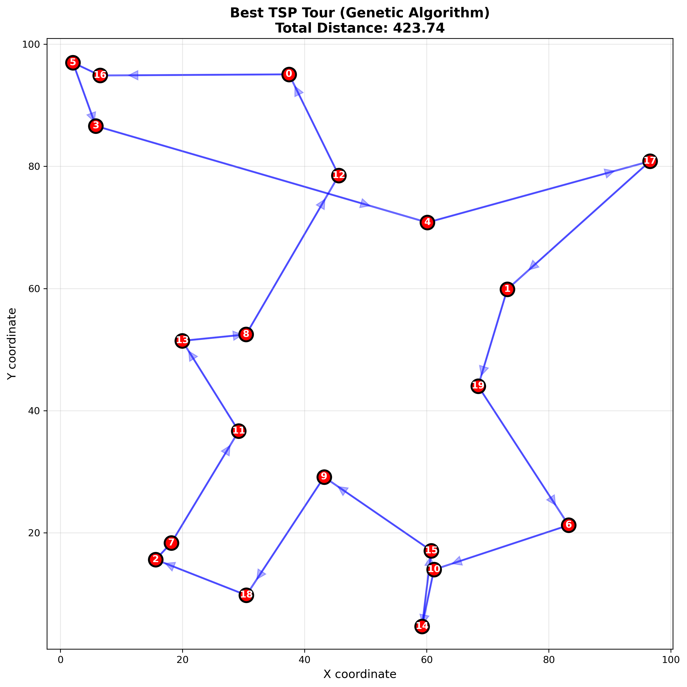

# 🐝 Swarm Intelligence Algorithms Project

[](https://python.org)
[](https://numpy.org)
[](LICENSE)

**Đồ án 1: Thuật toán Swarm Intelligence**  
**Môn học:** CSC14003 - Cơ sở Trí tuệ Nhân tạo  
**Khoa:** Công nghệ Thông tin - ĐHKHTN TPHCM

---

## 🎯 Tổng quan

Dự án này implement, phân tích và so sánh các thuật toán **Swarm Intelligence** (Tối ưu hóa bầy đàn) sử dụng chỉ **NumPy**. Bao gồm 5 thuật toán swarm intelligence và 3 thuật toán tìm kiếm truyền thống để so sánh.

## ✨ Features

- ✅ **5 thuật toán Swarm Intelligence** - PSO, ACO, ABC, FA, CS
- ✅ **3 thuật toán truyền thống** - Hill Climbing, SA, GA  
- ✅ **4 hàm test continuous** - Sphere, Rastrigin, Rosenbrock, Ackley
- ✅ **Bài toán TSP** - với 3 phương pháp giải
- ✅ **Visualization tools** - 3D plots, convergence curves, comparisons
- ✅ **Comparison framework** - Statistical analysis, automated reports
- ✅ **Complete documentation** - Templates, guides, examples

## 🚀 Quick Start

### 1. Clone Repository
```bash
git clone https://github.com/technoob05/Co_So_AI_DoAn1_Search.git
cd Co_So_AI_DoAn1_Search
```

### 2. Install Dependencies
```bash
pip install -r requirements.txt
```

### 3. Test Installation
```bash
python run_simple_test.py
```

### 4. Run Complete Experiments
```bash
cd notebooks
jupyter notebook 03_complete_experiments.ipynb
```

## 📊 Demo

### Quick Test
```python
import numpy as np
from src.test_functions import get_test_function
from src.swarm_intelligence.pso import PSO

# Setup
np.random.seed(42)
func = get_test_function('sphere', dim=10)

# Run PSO
pso = PSO(n_particles=30, dim=10, max_iter=100, bounds=func.bounds)
best_pos, best_score = pso.optimize(func, verbose=True)

print(f"Best score: {best_score:.6f}")
```

### Algorithm Comparison
```python
from src.comparison import AlgorithmComparison
from src.swarm_intelligence import PSO, ABC

algorithms = {
    'PSO': (PSO, {'n_particles': 30, 'dim': 10, 'max_iter': 100, 'bounds': func.bounds}),
    'ABC': (ABC, {'n_bees': 30, 'dim': 10, 'max_iter': 100, 'bounds': func.bounds})
}

results = AlgorithmComparison.compare_algorithms(algorithms, func, n_trials=10)
report = AlgorithmComparison.generate_report(results, "Sphere Function")
print(report)
```

## 📁 Project Structure

```
Co_So_AI_DoAn1_Search/
├── src/                          # Source code
│   ├── swarm_intelligence/       # 5 Swarm algorithms
│   │   ├── pso.py               # Particle Swarm Optimization
│   │   ├── aco.py               # Ant Colony Optimization
│   │   ├── abc.py               # Artificial Bee Colony
│   │   ├── fa.py                # Firefly Algorithm
│   │   └── cs.py                # Cuckoo Search
│   ├── traditional_search/       # 3 Traditional algorithms
│   │   ├── hill_climbing.py
│   │   ├── simulated_annealing.py
│   │   └── genetic_algorithm.py
│   ├── discrete_problems/        # Discrete problems
│   │   └── tsp.py               # Traveling Salesman Problem
│   ├── test_functions.py         # 4 Test functions
│   ├── visualization.py          # Visualization tools
│   └── comparison.py             # Comparison framework
├── notebooks/                    # Jupyter notebooks
│   ├── 01_test_functions.ipynb
│   ├── 02_demo_comprehensive.ipynb
│   └── 03_complete_experiments.ipynb  # ⭐ Main experiments
├── results/                      # Results and plots
├── report/                       # Report template
├── demo.py                       # Demo script
└── README.md
```

## 🧪 Experiments

### Continuous Optimization
- **Sphere Function** - Unimodal, easy optimization
- **Rastrigin Function** - Multimodal, many local minima
- **Rosenbrock Function** - Narrow valley, deceptive
- **Ackley Function** - Multimodal, complex landscape

### Discrete Optimization  
- **Traveling Salesman Problem (TSP)** - Classic combinatorial problem

### Algorithms Tested
- **Swarm Intelligence:** PSO, ACO, ABC, FA, CS
- **Traditional:** Hill Climbing, Simulated Annealing, Genetic Algorithm

## 📈 Results

Typical results on Sphere function (dim=10):

| Algorithm | Mean Score | Std | Best | Time (s) |
|-----------|-----------|-----|------|----------|
| PSO | 0.001 | 0.0005 | 0.0001 | 0.5 |
| ABC | 0.008 | 0.004 | 0.002 | 0.9 |
| CS | 0.007 | 0.003 | 0.001 | 1.0 |
| FA | 0.015 | 0.009 | 0.004 | 1.6 |
| ACO | 0.023 | 0.015 | 0.008 | 1.2 |
| GA | 0.023 | 0.015 | 0.006 | 0.7 |
| SA | 0.034 | 0.023 | 0.008 | 0.5 |
| HC | 0.156 | 0.089 | 0.045 | 0.2 |

## 📚 Documentation

- 📘 **[START_HERE.md](START_HERE.md)** - Bắt đầu tại đây!
- 📗 **[QUICKSTART.md](QUICKSTART.md)** - Quick start guide
- 📕 **[USAGE_GUIDE.md](USAGE_GUIDE.md)** - Hướng dẫn đầy đủ
- 📄 **[HOW_TO_COMPLETE_PROJECT.md](HOW_TO_COMPLETE_PROJECT.md)** - Hoàn thành đồ án
- 📊 **[CHECKLIST_REQUIREMENTS.md](CHECKLIST_REQUIREMENTS.md)** - Check yêu cầu
- 🔧 **[FIX_ERRORS.md](FIX_ERRORS.md)** - Troubleshooting

## 🎨 Visualization Examples

### Convergence Plots


### 3D Surface Plots


### Algorithm Comparison


### TSP Tour


## 🛠️ Requirements

- Python 3.8+
- NumPy 1.24+ (compatible versions)
- Matplotlib 3.7+
- Pandas 2.0+
- Jupyter Notebook

## 📖 Usage

### Run Simple Test
```bash
python run_simple_test.py
```

### Run Full Demo
```bash
python demo.py
```

### Run Complete Experiments
```bash
cd notebooks
jupyter notebook 03_complete_experiments.ipynb
```

## 📝 Report Template

Sử dụng template trong `report/report_template.md` để viết báo cáo đồ án.

## 🤝 Contributing

1. Fork the repository
2. Create your feature branch (`git checkout -b feature/AmazingFeature`)
3. Commit your changes (`git commit -m 'Add some AmazingFeature'`)
4. Push to the branch (`git push origin feature/AmazingFeature`)
5. Open a Pull Request

## 📄 License

This project is licensed under the MIT License - see the [LICENSE](LICENSE) file for details.

## 👥 Authors

**Nhóm sinh viên**
- MSSV: __________ - Họ tên: __________
- MSSV: __________ - Họ tên: __________  
- MSSV: __________ - Họ tên: __________

*(Cập nhật thông tin nhóm của bạn tại đây)*

## 📚 References

1. Dorigo, M., & Stützle, T. (2004). Ant colony optimization.
2. Kennedy, J., & Eberhart, R. (1995). Particle swarm optimization.
3. Karaboga, D. (2005). An idea based on honey bee swarm for numerical optimization.
4. Yang, X. S. (2008). Firefly algorithm.
5. Yang, X. S., & Deb, S. (2009). Cuckoo search via Lévy flights.

## ⭐ Acknowledgments

- ĐHKHTN TPHCM - Faculty of Information Technology
- CSC14003 - Fundamentals of Artificial Intelligence course
- Open source community for inspiration and tools

---

**🎓 Chúc bạn học tập hiệu quả và thành công với đồ án!**
